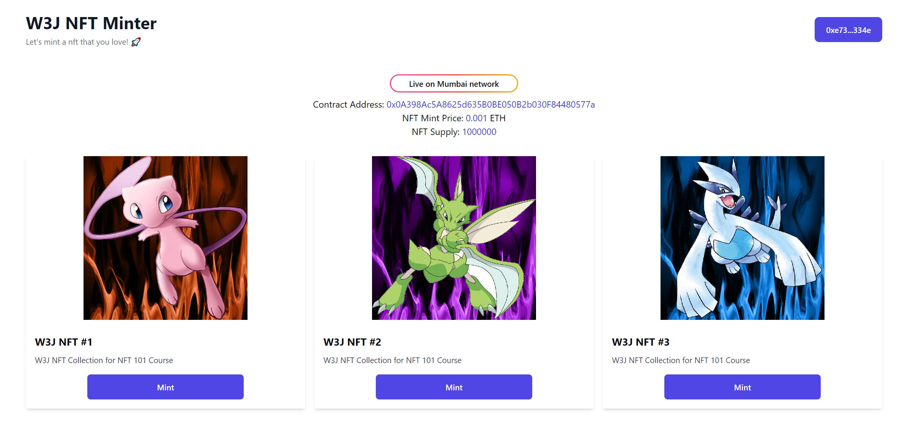

# NFT Minter

Smart contract deployed on Mumbai testnet: 
[0x0A398Ac5A8625d635B0BE050B2b030F84480577a](https://mumbai.polygonscan.com/address/0x0A398Ac5A8625d635B0BE050B2b030F84480577a)

Web Application deployed on Vercel: https://w3j-nft-minter.vercel.app/

Get rinkeby test: https://faucet.polygon.technology/

## Screenshot

## Language & Framework
* Hardhat framework (Write, test and deploy smart contract)
* Solidity 0.8.17
* Chai (Test smart contract)
* Pinata (IPFS)
* Reactjs (Use function component)
* Tailwindcss (HyperUI)
* Etherjs
* Vercel (Deploy web app)
* Alchemy, Mumbai (Deploy smart contract)